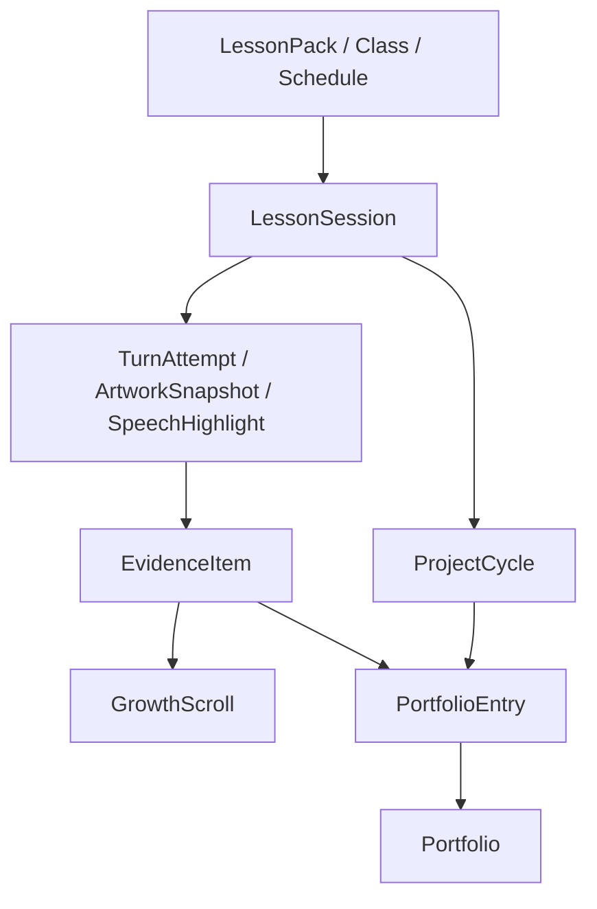
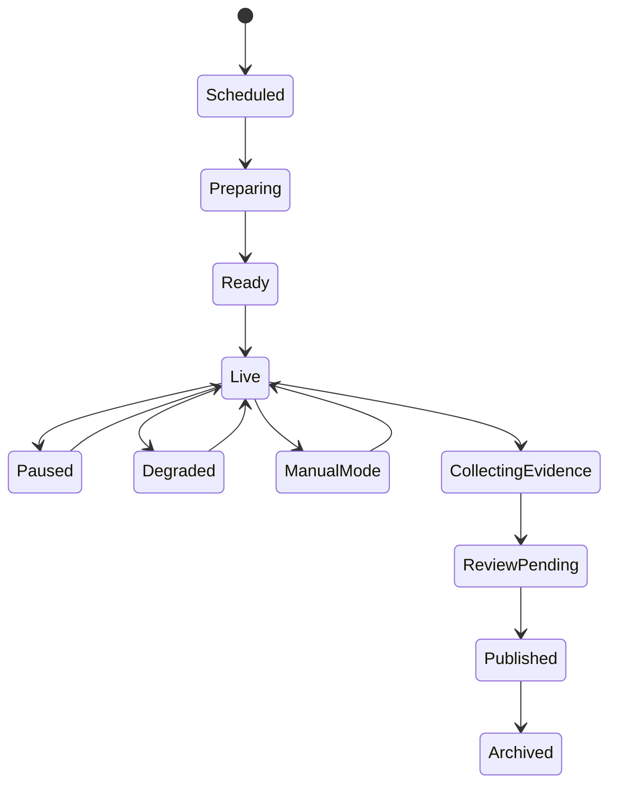
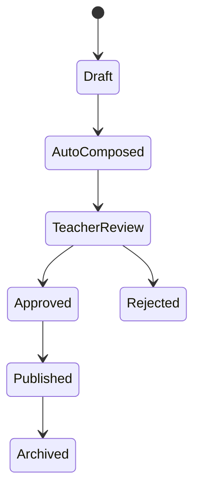
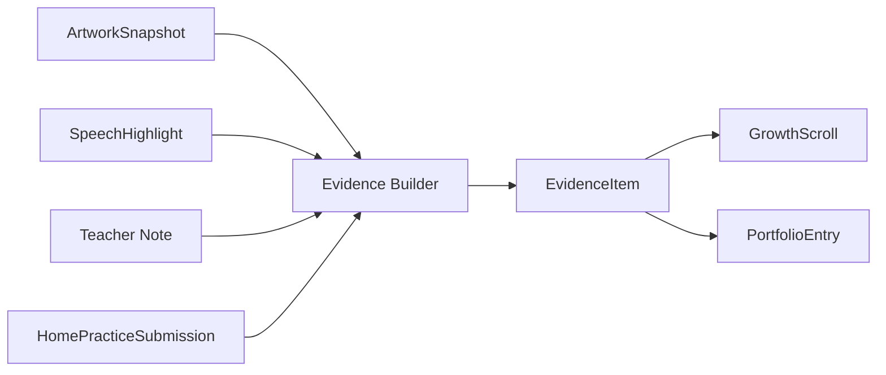
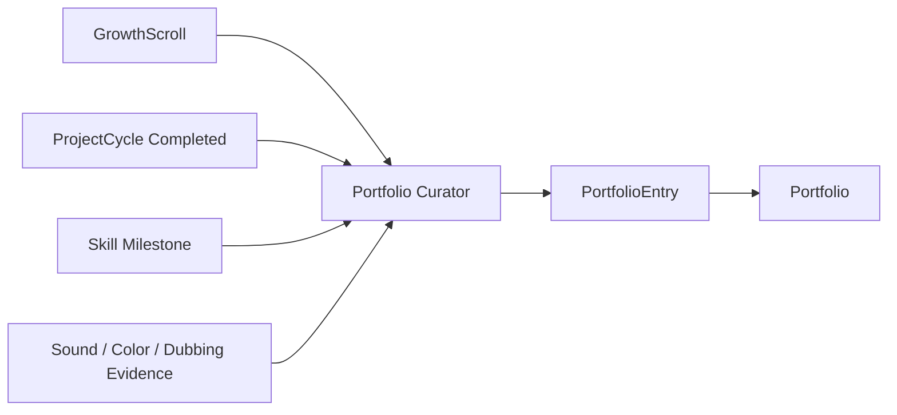
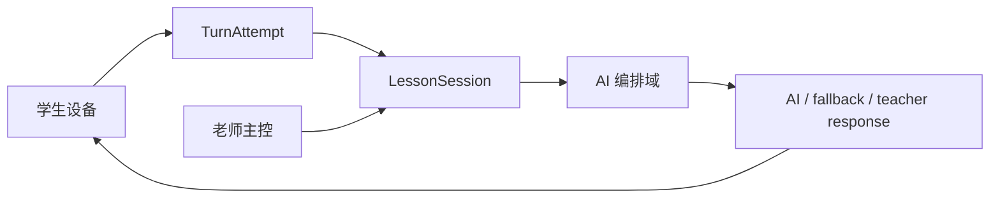
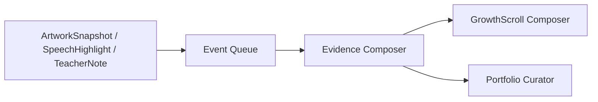
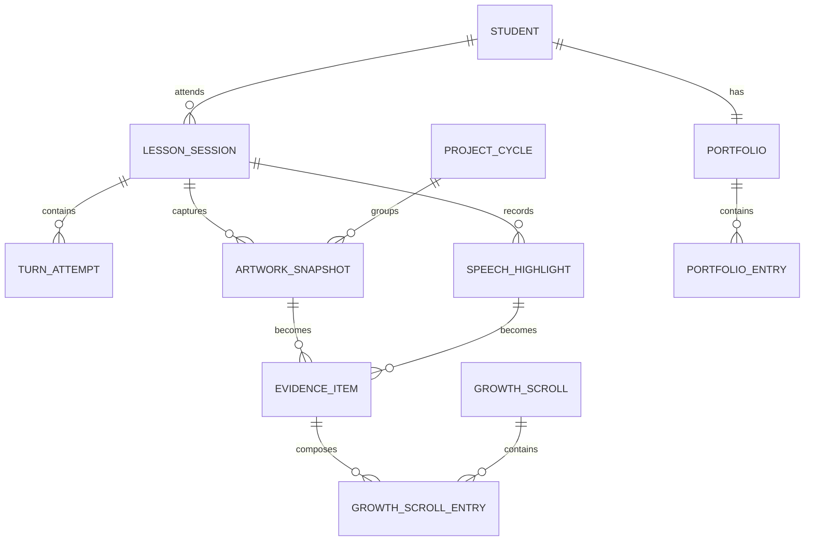

# Moyuan AI-Native Cultural Education System
## CORE_DATA_MODEL_V2
更新时间：2026-03-30

---

## 1. 这份文档的作用

这份文档是 V2 的数据母版，用来把系统从“世界观”压到“对象、关系、状态、可见性、事件流”。

它回答：
- 系统里真正有哪些中心对象
- 哪些对象是课堂运行态，哪些对象是长期资产
- 哪些对象进入家长端，哪些只在系统内部存在
- 各对象如何通过状态流与事件流连接起来

这份文档应与以下文档一起阅读：
- `MASTER_SYSTEM_PLAN_V2.md`
- `IMPLEMENTATION_ROADMAP_V2.md`
- `MODULE_CATALOG_V2.md`

---

## 2. 数据模型总原则

### 2.1 系统中心不是课程，而是作品与证据
课程、班级、排课只是上下文。真正会成为资产的是：
- 作品如何被留下
- 围绕作品说了什么
- 课堂里出现了什么 evidence
- evidence 如何被编排成家长可见结果
- 最终如何进入 portfolio

### 2.2 原始对象与家长视图必须分层
系统必须区分：
- raw objects
- composed views
- long-term assets

例如：
- `TurnAttempt` 是 raw object
- `EvidenceItem` 是标准化中间对象
- `GrowthScroll` 是 parent-facing view
- `Portfolio` 是 long-term asset

### 2.3 状态机比字段更重要
关键对象必须明确状态流，例如：
- `draft -> approved -> published`
- `not_started -> in_progress -> completed`
- `live -> degraded -> manual -> archived`

### 2.4 可见性必须显式建模
每个重要 evidence 都必须有：
- `visibility_scope`
- `review_status`
- `source_session_id`
- `project_cycle_id`
- `published_at`

---

## 3. 顶层对象分层图



---

## 4. 核心对象总览表

| 层级 | 对象 | 主要作用 | 主要消费者 |
|---|---|---|---|
| 上下文层 | LessonPack | 定义课堂节点、知识卡、老师脚本 | 老师端、课堂域 |
| 上下文层 | Class / Course / Schedule | 定义谁在什么时候上什么课 | 运营域、老师端、管理端 |
| 会话层 | LessonSession | 承载一节课的真实状态 | 老师端、课堂域、管理端 |
| 原始素材层 | TurnAttempt | 记录孩子一次输入与 AI 回应 | 课堂域、AI 域、管理端 |
| 原始素材层 | ArtworkSnapshot | 记录某次课留下的作品阶段 | 老师端、作品中台、家长端 |
| 原始素材层 | SpeechHighlight | 记录值得留下的一句话 | 老师端、家长端、AI 学伴 |
| 标准化层 | EvidenceItem | 所有可沉淀对象的统一出口 | Scroll、Portfolio、管理端 |
| 编排视图层 | GrowthScroll | 家长单课视图 | 家长端 |
| 周期层 | ProjectCycle | 多节课作品成长路径 | 老师端、管理端、Portfolio |
| 长期资产层 | Portfolio | 长期成长档案 | 家长端、管理端 |

---

## 5. 上下文层对象

### 5.1 LessonPack

```yaml
LessonPack:
  lesson_pack_id: string
  title: string
  course_type: calligraphy|painting|culture|language
  age_band: string
  theme: string
  duration_minutes: int
  learning_goals: string[]
  assets:
    - asset_id
    - type
    - uri
    - preload_required
  nodes:
    - node_id
    - node_type
    - prompt
    - allowed_facts[]
    - fallback_options[]
    - max_followups
    - expected_input_mode
  teacher_script:
    intro
    pacing_notes[]
    intervention_points[]
```

### 5.2 Class / Course / Schedule

```yaml
Course:
  course_id: string
  course_type: calligraphy|painting|culture|language
  title: string
  age_band: string
  branch_id: string

Class:
  class_id: string
  course_id: string
  teacher_id: string
  student_ids: string[]
  branch_id: string
  recurring_schedule_id: string

ScheduleSlot:
  schedule_id: string
  class_id: string
  lesson_pack_id: string
  starts_at: datetime
  ends_at: datetime
  room_name: string
```

---

## 6. 会话层对象

### 6.1 LessonSession

```yaml
LessonSession:
  session_id: string
  lesson_pack_id: string
  class_id: string
  teacher_id: string
  schedule_id: string
  state: scheduled|preparing|ready|live|paused|degraded|manual_mode|collecting_evidence|review_pending|published|archived|cancelled
  authority_source: teacher_app
  current_node_id: string
  network_health: good|medium|poor
  classroom_noise: low|medium|high
  expected_students: int
  joined_students: int
  actual_start_at: datetime
  actual_end_at: datetime
```

### 6.2 LessonSession 状态机



---

## 7. 原始素材层对象

### 7.1 TurnAttempt

```yaml
TurnAttempt:
  attempt_id: string
  session_id: string
  student_id: string
  node_id: string
  input_mode: voice|tap|upload
  raw_input_text: string
  media_uri: string
  confidence_score: float
  latency_ms: int
  triggered_fallback: boolean
  teacher_override: boolean
  response_type: ai|fallback|teacher
  response_payload: json
  created_at: datetime
```

### 7.2 ArtworkSnapshot

```yaml
ArtworkSnapshot:
  artwork_id: string
  student_id: string
  class_id: string
  session_id: string
  project_cycle_id: string
  media_uri: string
  stage: draft|outline|midway|refinement|final
  crop_focus: whole|detail|stroke|composition
  tags: string[]
  teacher_selected: boolean
  captured_at: datetime
```

### 7.3 SpeechHighlight

```yaml
SpeechHighlight:
  speech_id: string
  student_id: string
  session_id: string
  audio_uri: string
  transcript: string
  highlight_type: proud_moment|concept_mastery|self_explanation|storytelling
  confidence: float
  teacher_selected: boolean
  created_at: datetime
```

---

## 8. 标准化证据层对象

### 8.1 EvidenceItem

```yaml
EvidenceItem:
  evidence_id: string
  student_id: string
  session_id: string
  project_cycle_id: string
  source_type: artwork|speech_highlight|teacher_note|color_reflection|sound_artifact|diary|home_practice|role_dubbing|duet_scene
  source_ref_id: string
  headline: string
  teacher_note: string
  visible_fields: string[]
  hidden_fields: string[]
  teacher_review_status: draft|approved|rejected
  visibility_scope: parent_only|teacher_only|admin_only|class_visible
  weight_score: int
  created_at: datetime
  published_at: datetime
```

### 8.2 生命周期



### 8.3 证据构建图



---

## 9. 编排视图层对象

### 9.1 GrowthScroll

```yaml
GrowthScroll:
  scroll_id: string
  student_id: string
  session_id: string
  attendance_status: present|late|absent
  hero_artwork_id: string
  proud_speech_id: string
  teacher_note: string
  progress_delta: string
  next_preview: string
  home_task_id: string
  published_at: datetime
```

### 9.2 GrowthScrollEntry

```yaml
GrowthScrollEntry:
  entry_id: string
  scroll_id: string
  evidence_id: string
  sequence_no: int
  entry_role: hero_artwork|proud_moment|color_reflection|sound_highlight|next_step
```

---

## 10. 周期层对象

### 10.1 ProjectCycle

```yaml
ProjectCycle:
  project_cycle_id: string
  student_id: string
  class_id: string
  course_type: calligraphy|painting
  project_title: string
  theme: string
  total_planned_sessions: int
  current_session_index: int
  status: not_started|in_progress|reviewing|completed
  final_goal: string
  started_at: datetime
  completed_at: datetime
```

### 10.2 CycleMilestone

```yaml
CycleMilestone:
  milestone_id: string
  project_cycle_id: string
  sequence_no: int
  milestone_name: string
  expected_output: string
  success_hint: string
  visible_to_parent: boolean
```

### 10.3 SessionContribution

```yaml
SessionContribution:
  contribution_id: string
  project_cycle_id: string
  session_id: string
  milestone_id: string
  student_id: string
  completion_delta: int
  teacher_note: string
  highlighted_artwork_id: string
  created_at: datetime
```

---

## 11. 长期资产层对象

### 11.1 Portfolio

```yaml
Portfolio:
  portfolio_id: string
  student_id: string
  title: string
  updated_at: datetime
```

### 11.2 PortfolioEntry

```yaml
PortfolioEntry:
  portfolio_entry_id: string
  portfolio_id: string
  project_cycle_id: string
  artwork_id: string
  evidence_id: string
  skill_tag: string
  curator_note: string
  added_at: datetime
```

### 11.3 长期资产沉淀图



---

## 12. 权限与可见性

| 角色 | 可见对象 | 不可见对象 |
|---|---|---|
| 家长 | 自己孩子的 GrowthScroll、已发布 Portfolio、已发布课后任务结果 | draft evidence、其他孩子 raw 数据 |
| 老师 | 自己班级的 LessonSession、ArtworkSnapshot、SpeechHighlight、draft/published Evidence | 跨班级管理指标细节 |
| 管理端 | 聚合指标、审计、例外事件、作品沉淀率 | 默认不看 raw 儿童内容，除非审计权限 |
| 孩子 | 自己的角色、课后任务、自己可见的 diary / card | 其他孩子内容、管理信息 |

---

## 13. 事件流与异步流

### 13.1 实时课堂流



### 13.2 异步课后流



---

## 14. 最小 ER 视图



---

## 15. 对工程实现最重要的约束

- 不允许把 GrowthScroll 当数据库源，它是视图，不是主数据
- 不允许跳过 EvidenceItem，任何进入家长端或 Portfolio 的内容都必须先标准化
- ProjectCycle 对作品型课程不是增强项，而是必要对象
- LessonSession 必须是课堂权威状态源，不是学生设备，不是 AI

---

## 16. 一句话总结

> **V2 不是“功能越来越多”，而是“所有内容最终都能被压回同一套数据母版”。**
