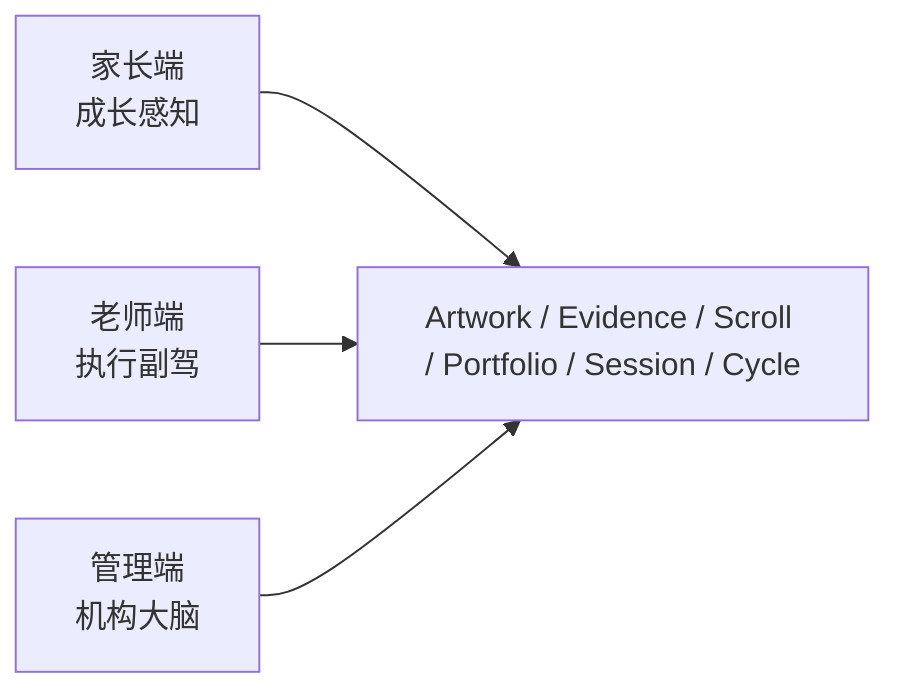
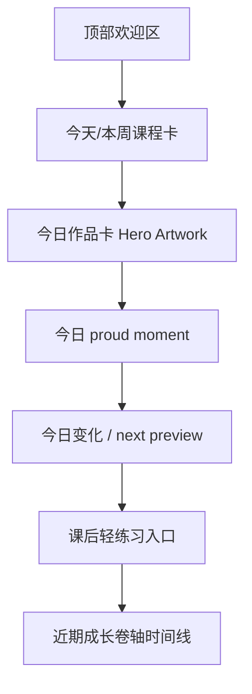
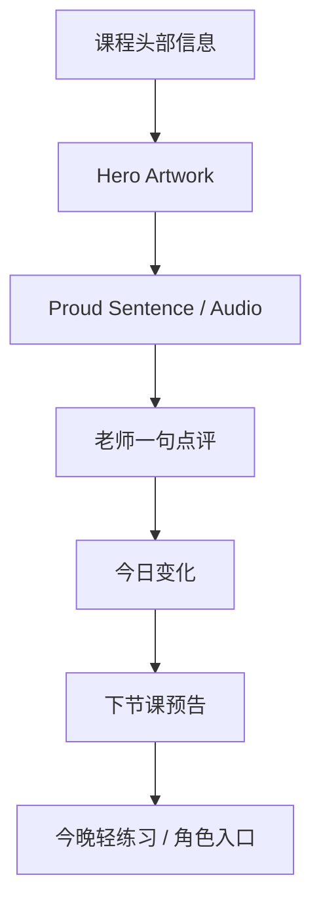
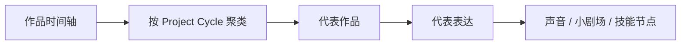
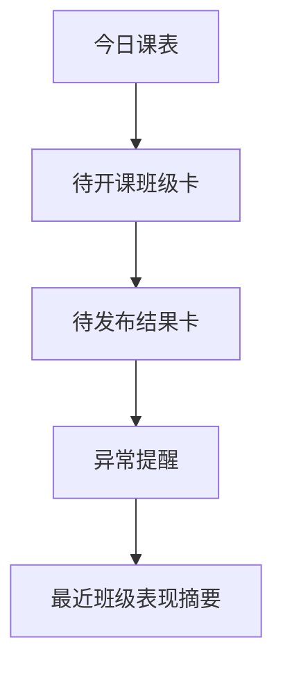
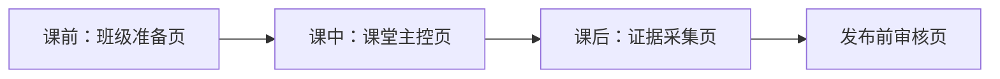
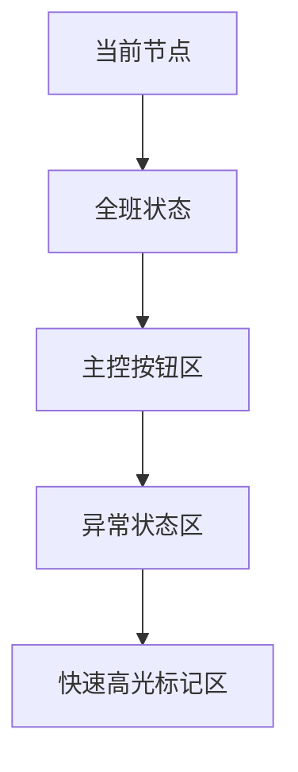
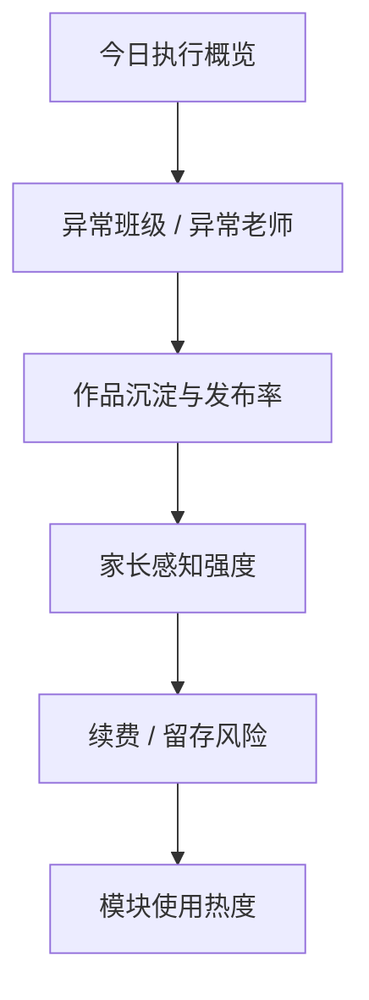
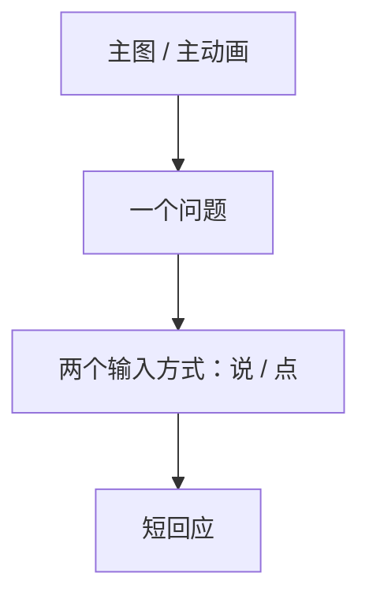

# Moyuan AI-Native Cultural Education System
## PARENT_TEACHER_ADMIN_PAGE_BLUEPRINTS
更新时间：2026-03-30

---

## 1. 这份文档的作用

这份文档把三端分离从“功能描述”压到“页面蓝图”。

它回答：

- 家长端首页到底先看到什么
- Growth Scroll 页面长什么样
- 老师端一节课前中后的操作路径如何最短
- 管理端看板不应该只是报表，而应该先看哪几类控制感指标
- 每一屏对应哪些中心对象

这份文档不是视觉稿，  
但它应该足够具体到：

- 产品能画 wireframe
- 设计能定信息层级
- 前端能分页面与组件
- 后端能知道页面依赖哪些对象

---

## 2. 三端统一原则

### 2.1 三端分离，底层统一
- 家长端不是老师端的简化版
- 老师端不是管理端的子集
- 管理端不是数据堆砌版家长端

但三端都必须建立在同一批中心对象之上：

- ArtworkSnapshot
- EvidenceItem
- GrowthScroll
- ProjectCycle
- Portfolio
- LessonSession

### 2.2 页面必须围绕任务，不围绕菜单
尤其对家长端和老师端：

- 家长打开不是为了研究系统结构，而是为了看孩子变化
- 老师打开不是为了管理很多菜单，而是为了顺畅带课和快速发布
- 管理端打开不是为了浏览所有数据，而是为了判断机构有没有失控

---

## 3. 三端信息结构总图



---

## 4. 家长端：Moyuan Family

### 4.1 家长端首页的任务
家长端首页必须在 5 秒内回答这四件事：

- 今天孩子有没有来
- 今天孩子做了什么
- 今天哪里有变化
- 下次怎么接上

### 4.2 家长端首页结构



### 4.3 家长端首页模块明细

| 区块 | 主要对象 | 作用 |
|---|---|---|
| 顶部欢迎区 | Student, Class | 显示孩子身份、当前课程状态 |
| 今天/本周课程卡 | Schedule, Attendance | 回答今天来没来、下次什么时候上 |
| 今日作品卡 | ArtworkSnapshot | 让家长立刻看到今天最重要的作品 |
| proud moment | SpeechHighlight / EvidenceItem | 让家长听到或看到最值得留的一句 |
| 今日变化 | GrowthScroll | 用一句话解释今天进步在哪里 |
| next preview | GrowthScroll | 告诉家长下次会做什么 |
| 课后轻练习入口 | HomePractice | 让家长知道今天可继续什么 |
| 近期卷轴 | GrowthScroll list | 形成连续成长感 |

### 4.4 家长端首页线框图

```text
┌──────────────────────────────┐
│  Liam · P2 山水班             │
│  本周已上 1/2 节             │
├──────────────────────────────┤
│  今天课程：山的不同叫法      │
│  出勤：Present               │
│  下节课：4 月 2 日 4:00 PM   │
├──────────────────────────────┤
│  今日作品 Hero Artwork       │
│  [作品大图]                  │
│  当前阶段：Midway            │
├──────────────────────────────┤
│  Proud Moment                │
│  “我最喜欢山峰，因为它尖尖的” │
├──────────────────────────────┤
│  今日变化                     │
│  今天第一次完整说出原因句     │
│  下次会继续：加山的层次       │
├──────────────────────────────┤
│  今晚小练习                   │
│  和角色讲一讲你的山最喜欢哪里 │
├──────────────────────────────┤
│  最近成长卷轴                 │
│  [Scroll 1] [Scroll 2] ...   │
└──────────────────────────────┘
```

---

## 5. 家长端二级页

### 5.1 Growth Scroll 详情页

#### 页面任务
让家长完整理解一节课，而不是只看一条消息。

#### 页面结构



#### 页面依赖对象
- GrowthScroll
- GrowthScrollEntry
- ArtworkSnapshot
- SpeechHighlight
- EvidenceItem

---

### 5.2 Portfolio 页面

#### 页面任务
让家长看到长期成长，而不是单节课碎片。

#### 页面结构



#### 主要分区
- 按课程线/主题线看
- 按 project cycle 看
- 按技能成长看
- 按多模态看（图 / 文 / 声）

---

### 5.3 Calendar 页面

不需要复杂。  
只需要：

- 课程时间
- 出勤状态
- 调课/补课
- upcoming preview

不要让它成为家长端中心页面。  
它只是工具页。

---

## 6. 老师端：Moyuan Studio

### 6.1 老师端的核心目标
老师端必须让老师感觉：

- 少点按钮
- 少做重复劳动
- 不破坏课堂节奏
- 课后 1 分钟能收尾

### 6.2 老师端首页任务
老师打开老师端最想做的事情只有三件：

- 看今天要上什么
- 一键开课
- 课后快速发布今天结果

所以老师端不该先展示很多统计，而应先展示：

- 今日课表
- 待开课班级
- 待发布课后结果
- 异常提醒

### 6.3 老师端首页结构



### 6.4 老师端首页线框图

```text
┌──────────────────────────────┐
│  今日课表                     │
│  4:00 P2 山水班   [开课]      │
│  6:00 K2 颜色班   [开课]      │
├──────────────────────────────┤
│  待发布结果                   │
│  P2 山水班 · 2 条未发布       │
│  [继续发布]                  │
├──────────────────────────────┤
│  异常提醒                     │
│  今天 1 人请假                │
│  山水班网络降级 1 次          │
└──────────────────────────────┘
```

---

## 7. 老师端一节课前中后页面流



### 7.1 课前：班级准备页

#### 目标
老师在 10 秒内知道：
- 今天上什么
- 谁来了
- project cycle 现在到哪
- 系统给的课后延续建议是什么

#### 页面结构
- 班级信息
- 今日 lesson pack
- 今日 project cycle 节点
- 学生列表与签到
- 一键开课

---

### 7.2 课中：课堂主控页

#### 目标
老师必须始终是权威状态源。

#### 页面结构



#### 必须有的按钮
- 下一步
- 重问
- fallback
- 暂停
- 手动模式
- 标记一句高光
- 拍作品

#### 页面线框图

```text
┌────────────────────────────────────┐
│  节点 2/5：观察山峰                │
│  当前模式：Live                    │
│  加入学生：9/10                    │
├────────────────────────────────────┤
│  [下一步] [重问] [fallback] [暂停] │
│  [手动] [高光] [拍作品]            │
├────────────────────────────────────┤
│  系统状态：网络良好 / 噪音中等      │
│  本节点已触发 fallback 0 次         │
└────────────────────────────────────┘
```

---

### 7.3 课后：证据采集页

#### 目标
老师只做最少动作，把今天课程收成 evidence。

#### 页面结构
- 作品快照选择
- proud moment 选择
- 老师一句点评
- 今天变化 auto draft
- 下次预告 auto draft
- 课后练习草稿

#### 原则
这页绝不能像写报告。  
最多是“勾选 + 一句补充”。

---

### 7.4 发布前审核页

#### 目标
老师不是逐条重写，而是做轻审核。

#### 页面结构
- 系统生成的 Growth Scroll 草稿
- 家长可见内容预览
- 编辑/通过/退回按钮

---

## 8. 管理端：Moyuan Command

### 8.1 管理端的任务
管理端不该先看“总访问量”或“总推送量”。  
它要先看机构是否被稳稳地执行着。

### 8.2 管理端首页必须回答的 5 个问题
- 今天老师有没有按课包执行
- 哪些班今天异常
- 哪些课程 evidence 沉淀弱
- 哪些内容更能形成家长感知
- 留存/续费和执行有没有关系

### 8.3 管理端首页结构



### 8.4 管理端首页模块明细

| 模块 | 核心问题 | 主要对象 |
|---|---|---|
| 今日执行概览 | 今天几节课正常跑完 | LessonSession |
| 异常班级 | 哪些班掉线、降级、缺勤异常 | LessonSession, Attendance |
| 作品沉淀率 | 哪些班没有形成足够作品和 evidence | ArtworkSnapshot, EvidenceItem |
| 家长感知强度 | 哪些班 Scroll 发布完整、内容质量高 | GrowthScroll |
| 留存/续费风险 | 哪些班孩子缺勤、家长互动低、阶段断裂 | Attendance, ProjectCycle |
| 模块使用热度 | 哪些 AI 模块真实被用起来 | Session logs, Evidence source types |

---

## 9. 管理端关键页面

### 9.1 教学执行看板
按校区 / 老师 / 班级切换，看：

- session 完成率
- degraded/manual 比例
- teacher override 比率
- 作品快照产出率
- scroll 发布率

### 9.2 课程与内容效果页
看：

- 哪些 LessonPack 更容易形成作品
- 哪些主题更容易形成 proud moment
- 哪些桥接内容更容易带回课后互动
- 哪些模块家长反馈更好

### 9.3 留存与阶段页
按 ProjectCycle 看：

- 哪些作品周期完成率高
- 哪些孩子卡在中间阶段
- 哪些班续费前 evidence 最弱
- 哪些老师的 project cycle 管理更稳

---

## 10. 学生课堂模式：Student Classroom Mode

### 10.1 目标
学生端在课堂里只承担简单动作：

- 点选
- 说一句
- 看回应
- 上传/展示作品

### 10.2 页面原则
- 一屏只做一件事
- 不让孩子做复杂导航
- 不显示后台状态和多余信息
- 只有老师能推进课堂

### 10.3 页面结构



### 10.4 线框图

```text
┌──────────────────────────────┐
│       [主图 / 热点]           │
│                              │
│  你觉得哪一个更像“峰”？      │
│                              │
│   [按住说话]   [点选答案]     │
│                              │
│  AI：我听懂啦，它尖尖的像峰。 │
└──────────────────────────────┘
```

---

## 11. 页面与中心对象映射表

| 页面 | 主要对象 |
|---|---|
| 家长首页 | GrowthScroll, ArtworkSnapshot, Schedule |
| Growth Scroll 详情 | GrowthScroll, GrowthScrollEntry, EvidenceItem |
| Portfolio | Portfolio, PortfolioEntry, ProjectCycle |
| 老师首页 | ScheduleSlot, LessonSession |
| 班级准备页 | LessonPack, ProjectCycle, Attendance |
| 课堂主控页 | LessonSession, TurnAttempt |
| 证据采集页 | ArtworkSnapshot, SpeechHighlight, EvidenceItem draft |
| 发布审核页 | GrowthScroll draft |
| 管理端首页 | LessonSession aggregate, Evidence aggregate, GrowthScroll aggregate |
| 学生课堂页 | LessonSession current node, LessonPack node |

---

## 12. 页面级成功标准

### 家长端成功标准
- 5 秒内看到今天最重要的内容
- 不需要点很多层才能知道孩子今天做了什么
- 课后延续入口自然，不像广告位

### 老师端成功标准
- 开课前操作少于 3 个动作
- 课中不需要频繁切页面
- 课后 1 分钟内能完成 evidence 收尾

### 管理端成功标准
- 首页一眼看到机构是否正常执行
- 不靠翻报表才能发现问题
- 可以把问题追到班级和对象层

---

## 13. 组件复用建议

### 家长端与老师端可复用
- Artwork card
- Proud moment card
- Scroll preview card
- Project cycle progress bar

### 管理端单独组件
- Exception table
- Session heatmap
- Evidence density chart
- Cycle completion matrix

---

## 14. 一句话总结

> **三端页面不是从菜单长出来的，而是从“谁今天最想完成什么任务”长出来的。**
