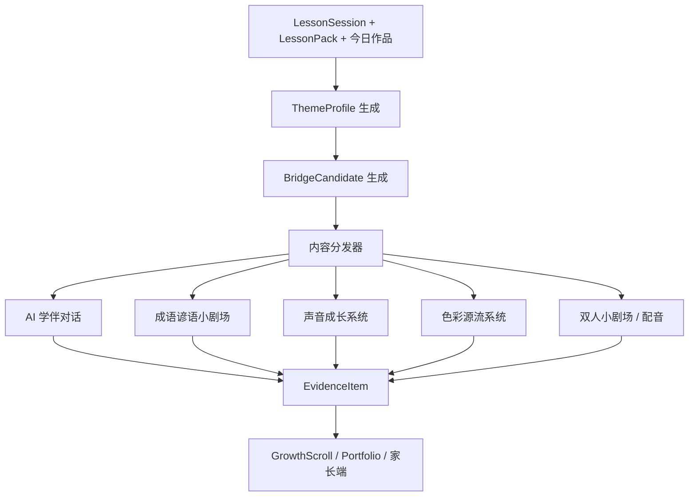
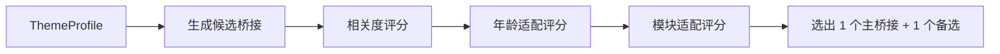
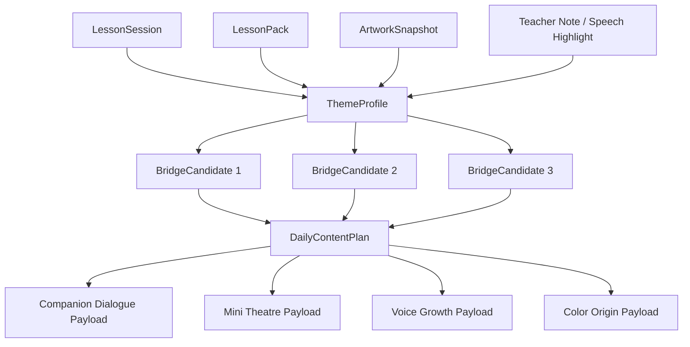

# Moyuan AI-Native Cultural Education System
## THEME_LINKAGE_LAYER
更新时间：2026-03-30

---

## 1. 这份文档的作用

这份文档把 V2 里最关键、但之前还没有正式落库的一层写清楚：

> **课题联动层（Theme Linkage Layer）**

它不是一个单独给孩子看的模块，  
而是整套孩子端内容世界的统一编排脑。

它解决的问题是：

- 为什么课后不会变成另一个不相干的产品
- 为什么角色对话、小剧场、声音成长、色彩源流不会各自精彩
- 为什么家长会感受到课堂和课后是一体的
- 为什么系统不会每天随机推内容

---

## 2. 一句话定义

**课题联动层**是 Moyuan 系统中负责识别当日课堂主题、抽象课题画像、选择最自然桥接路径，并将内容分发到课后模块的编排层。

它确保：

- 优先围绕今天课题直连
- 不能直连时做近距离桥接
- 桥接之后必须回到作品、表达或成长证据
- 孩子端内容始终共享同一条主轴

---

## 3. 为什么这一层必须存在

如果没有这层，系统会退化成：

- 课堂是课堂
- 课后是课后
- 角色在聊自己的
- 小剧场在放自己的
- 声音模块在做自己的
- 色彩模块突然冒出来
- 家长端只能看到一堆松散活动

你们现在已经有这些模块：

- AI 学伴成长系统
- 成语谚语小剧场
- 双人小剧场配音
- 声音成长系统
- 色彩源流系统
- 作品中台
- Growth Scroll

它们每个都成立。  
但如果没有“今天这节课到底该怎么往外长”的统一编排层，  
这些模块会重新变成拼盘。

---

## 4. 课题联动层的核心原则

### 4.1 优先直连
如果今天课堂本身就学的是：

- 成语
- 谚语
- 古诗
- 历史故事
- 汉字文化

那课后直接延续它。  
不要额外绕弯。

### 4.2 不能直连时才桥接
如果今天课堂学的是：

- 画画主题
- 色彩
- 构图
- 国画技法
- 书法节奏
- 某个现代作品对象

那课后不强行硬贴成语或典故，  
而是通过最自然的桥接方式进入中国文化。

### 4.3 桥接必须“近”
桥接不是“只要沾一点文化就行”。  
它必须尽量靠近今天课堂的：

- 主题
- 视觉元素
- 情绪气质
- 动作行为
- 颜色材料
- 精神内核

### 4.4 最终必须回到作品或表达
桥接之后，系统必须引导孩子：

- 说回今天的作品
- 说回今天学到的内容
- 完成一个课后表达动作
- 留下 evidence

如果做不到这一点，这次桥接就不成立。

---

## 5. 课题联动层总图



---

## 6. 输入：系统先看见什么

课题联动层的输入不是单一字段，而是一组课堂上下文。

### 6.1 必要输入

- `LessonSession`
- `LessonPack`
- 今日作品主题
- 今日关键词
- 今日颜色/材料重点
- 今日 project cycle 阶段
- 今日课堂证据候选（作品、表达、老师 notes）

### 6.2 结构化输入对象：ThemeProfile

```yaml
ThemeProfile:
  theme_profile_id: string
  session_id: string
  lesson_type: idiom|poem|history|artwork|color|calligraphy|mixed
  primary_topic: string
  secondary_topics: string[]
  visual_elements: string[]
  emotional_tone: string[]
  action_verbs: string[]
  cultural_anchor_candidates: string[]
```

### 6.3 ThemeProfile 的意义

它把“今天到底学了什么”从自然语言变成一张可推理的画像。  
没有这一步，系统后面只能做关键词硬匹配。

---

## 7. 课题类型分类

课题联动层第一步不是推内容，而是先判断今天属于哪一种课题。

### 7.1 文本直连型
今天本身就学的是文化文本：

- 成语
- 谚语
- 古诗词
- 历史故事
- 汉字文化

处理方式：
直接延续，不做桥接。

### 7.2 作品主题型
今天学的是一个具体作品对象：

- 飞机
- 山
- 花
- 船
- 桥
- 树
- 房子
- 鱼

处理方式：
从主题、意象、精神或动作桥接到最相关的文化内容。

### 7.3 视觉表达型
今天重点是怎么画、怎么写，而不是画什么：

- 构图
- 留白
- 动势
- 层次
- 远近
- 节奏
- 收尾

处理方式：
优先桥接到视觉意象、相关成语、相关小诗句、声音/色彩表达。

### 7.4 色彩材料型
今天重点是：

- 颜色
- 墨色
- 材料感
- 层次气质

处理方式：
优先调用色彩源流系统和作品反思。

### 7.5 精神主题型
今天表面在画一个东西，但真正重要的是：

- 探索
- 远行
- 坚持
- 安静
- 生长
- 勇敢
- 想象

处理方式：
优先桥接到中国文化里的精神意象、小故事、成语或角色对话。

---

## 8. 桥接模式

桥接不只靠“主题像不像”。  
系统必须允许 6 种桥接模式。

### 8.1 Direct Link
直接延续今天学的文本。

### 8.2 Theme Bridge
从“今天画了什么 / 学了什么对象”切过去。

### 8.3 Imagery Bridge
从意象、画面感、自然元素切过去。

### 8.4 Spirit Bridge
从精神内核切过去。

### 8.5 Color Bridge
从颜色、材料、墨色气质切过去。

### 8.6 Action Bridge
从今天做了什么动作、产生了什么行为感切过去。

---

## 9. 桥接模式对照表

| Bridge Mode | 适用情况 | 最适合连接的模块 | 示例 |
|---|---|---|---|
| direct | 今天本身学文本 | 小剧场、配音、跟读、角色复述 | 今天学了谚语，晚上继续演出来 |
| theme | 今天是具体主题对象 | 角色对话、小剧场、声音成长 | 今天画飞机，晚上桥接飞行/远行 |
| imagery | 今天画面感强 | 诗句、小剧场、作品反思 | 今天画山水，晚上聊远山、云、水 |
| spirit | 今天有明显精神主线 | 成语、小故事、角色引导 | 今天练书法节奏，桥接耐心与收束 |
| color | 今天颜色重要 | 色彩源流、作品反思 | 今天用了石青，晚上聊它像什么 |
| action | 今天行为感强 | 成语、双人剧场、配音 | 今天最后一点收尾，桥接画龙点睛 |

---

## 10. 桥接候选对象：BridgeCandidate

系统应该先生成多个候选，再选优，而不是看到一个关键词就直接推。

```yaml
BridgeCandidate:
  candidate_id: string
  session_id: string
  bridge_mode: direct|theme|imagery|spirit|color|action
  bridge_topic: string
  relevance_score: float
  age_fit_score: float
  module_fit:
    - mini_theatre
    - companion_dialogue
    - voice_growth
    - color_origin
    - duet_scene
  reason_text: string
```

### 10.1 候选选择建议



---

## 11. DailyContentPlan：每天真正执行的计划单

所有课后模块都不应该自己决定今天干什么。  
真正执行的是 `DailyContentPlan`。

```yaml
DailyContentPlan:
  plan_id: string
  session_id: string
  selected_bridge_candidate_id: string
  selected_modules: string[]
  module_payloads: json
  parent_visible_goal: string
  child_output_goal: string[]
  created_at: datetime
```

### 11.1 示例：画飞机

```yaml
DailyContentPlan:
  session_id: "LS_20260330_A1"
  lesson_topic: "画飞机"
  topic_type: "artwork_theme"
  bridge_mode: "theme"
  bridge_topic: "飞行 / 远行 / 创造"
  selected_modules:
    - companion_dialogue
    - mini_theatre
    - voice_growth
  module_payloads:
    companion_dialogue: "今天你的飞机最想飞去哪里"
    mini_theatre: "中国古代飞行想象 / 木鸢短故事"
    voice_growth: "用一句完整话介绍你的飞机"
  parent_visible_goal: "家长看到课堂主题在家被自然延续"
  child_output_goal:
    - child_retell_sentence
    - artwork_expression
    - evidence_item
```

---

## 12. 内容分发优先级

### 12.1 Level 1：直接延续
如果今天学的是文化文本，优先推：

- 小剧场
- 配音
- 角色复述
- 跟读
- 声音成长

### 12.2 Level 2：作品主题桥接
如果今天学的是作品对象，优先推：

- 相关小剧场
- 角色对话
- 作品介绍
- 轻配音或声音任务

### 12.3 Level 3：视觉 / 颜色桥接
如果今天重点是颜色、留白、层次、构图，优先推：

- 色彩源流
- 声景 / 声音成长
- 作品感官描述
- 角色反思

### 12.4 Level 4：精神桥接
如果今天最强的是某种精神主题，优先推：

- 成语
- 小故事
- 角色追问
- 双人小剧场

---

## 13. 例子：今天画飞机，系统如何处理

### 13.1 输入识别
- `lesson_type = artwork`
- `primary_topic = 飞机`
- `secondary_topics = [天空, 飞行, 远行, 创造]`
- `action_verbs = [飞, 向上, 远行]`

### 13.2 候选桥接
- theme: 飞行 / 远行
- spirit: 探索 / 创造
- imagery: 天空 / 风 / 云

### 13.3 最终计划
系统选：
- `mini_theatre`: 古代飞行想象 / 木鸢
- `companion_dialogue`: 你的飞机想飞去哪里
- `voice_growth`: 用一句完整话介绍你的飞机

### 13.4 最终证据
- 作品快照
- 一句孩子介绍飞机的话
- 一个飞行想象小剧场参与记录
- Growth Scroll 上的一条“今天课堂如何在家延续”的结果

---

## 14. 例子：今天学的是成语

### 14.1 输入识别
- `lesson_type = idiom`
- `primary_topic = 画龙点睛`

### 14.2 候选桥接
- direct: 画龙点睛小剧场
- action: 最后一点、收尾、点睛

### 14.3 最终计划
系统选：
- `mini_theatre`: 画龙点睛小剧场
- `voice_growth`: 给一句关键台词配音
- `companion_dialogue`: 你今天作品里哪里最像点睛

这就是直连 + 回到作品。

---

## 15. 例子：今天重点是石青和山水颜色

### 15.1 输入识别
- `lesson_type = color`
- `primary_topic = 石青`
- `visual_elements = [山, 远山, 云]`

### 15.2 最终计划
系统选：
- `color_origin`: 石青来历旅程
- `companion_dialogue`: 你为什么把它用在远山
- `voice_growth`: 用一句完整话介绍你的山色

---

## 16. 和各模块的联动关系

### 16.1 和 AI 学伴成长系统
AI 学伴不自己找话题。  
课题联动层告诉它：

- 今天该围绕哪条主线聊
- 哪句 proud moment 值得追问
- 是做作品讲述，还是文化复述，还是颜色反思

### 16.2 和成语谚语小剧场
小剧场不应每天固定推一个成语。  
只有当：
- 今天本身学文本
- 或桥接后很自然
它才被选中。

### 16.3 和声音成长系统
声音模块必须由今天课题驱动。  
不然它会滑成独立音乐玩具。

### 16.4 和色彩源流系统
颜色模块只有在：
- 今日颜色重要
- 或 bridge 候选显示 color relevance 很高
才进入。

### 16.5 和双人小剧场配音
只有在今天课题适合剧场化协作时，  
才调起双人模式，不做每天强上。

---

## 17. 课题联动层的数据关系图



---

## 18. 老师端如何接入

这层不能增加老师负担。

### 18.1 默认模式
系统自动生成 `DailyContentPlan`。  
老师不用配置桥接逻辑。

### 18.2 轻确认模式
老师可看到一句：

- 推荐课后延续：飞行与远行小剧场
- 备选：角色对话 + 飞机介绍

老师只做：
- 确认
- 换备选

### 18.3 不允许的老师负担
老师不应该：
- 手写桥接脚本
- 自己找文化内容
- 每天配置多个模块

---

## 19. 家长端最终感知是什么

家长不需要知道 ThemeProfile 或 BridgeCandidate。  
家长最终感受到的是：

> 今天课堂学的内容，晚上继续活着。  
> 而且延续得很自然。

### 19.1 家长端应该看到
- 今天课堂主题是什么
- 课后延续采用了什么方式
- 孩子说出/配出/演出的是什么
- 为什么这和今天课堂连得上

### 19.2 家长不该看到
- 一堆模块名
- 随机冒出来的 unrelated AI 活动
- 和今天课堂毫无关系的花活

---

## 20. 课题联动层的边界条件

### 20.1 不做硬贴
今天课堂和某个文化点很弱，  
就不强行贴。

### 20.2 不每天全模块齐上
DailyContentPlan 应该选最自然的一到三个模块。  
不是每天把所有模块都开一遍。

### 20.3 不脱离课堂自成宇宙
课后不能像重新开了一门新课。

### 20.4 不让桥接超过低龄理解能力
桥接要近、轻、短、可解释。

---

## 21. 成功标准

### 21.1 系统级成功标准
- 课后模块的调用，不再是随机或固定模板
- 家长能感受到课堂与课后的主题一致性
- 孩子愿意在课后继续表达，而不是觉得换了个话题
- 管理端能看到哪些桥接方式最有效

### 21.2 内容级成功标准
- 今日课题与课后模块之间的相关度明显可解释
- 至少 80% 的课后任务能够回到作品、表达或成长证据
- 老师不需要额外策划桥接内容

---

## 22. 一句话总结

> **课题联动层不是“再加一个模块”，而是让所有孩子端模块共享同一条课堂主轴的统一编排层。**
